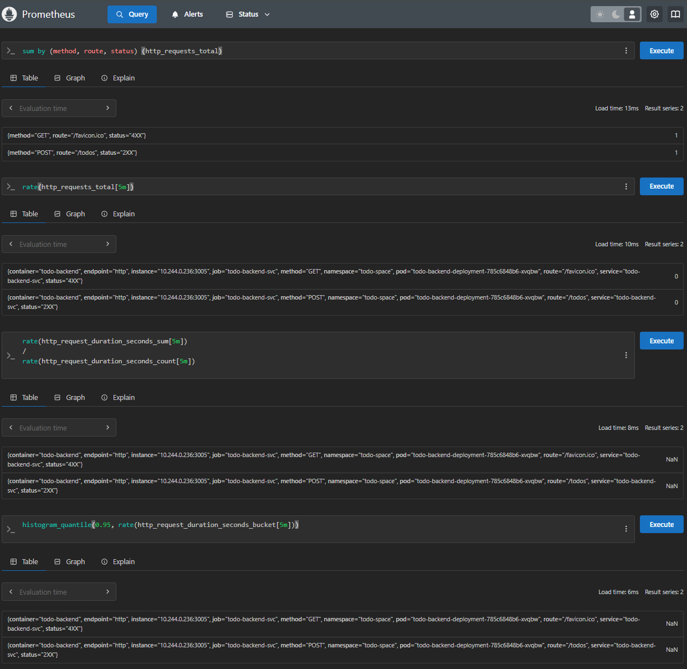
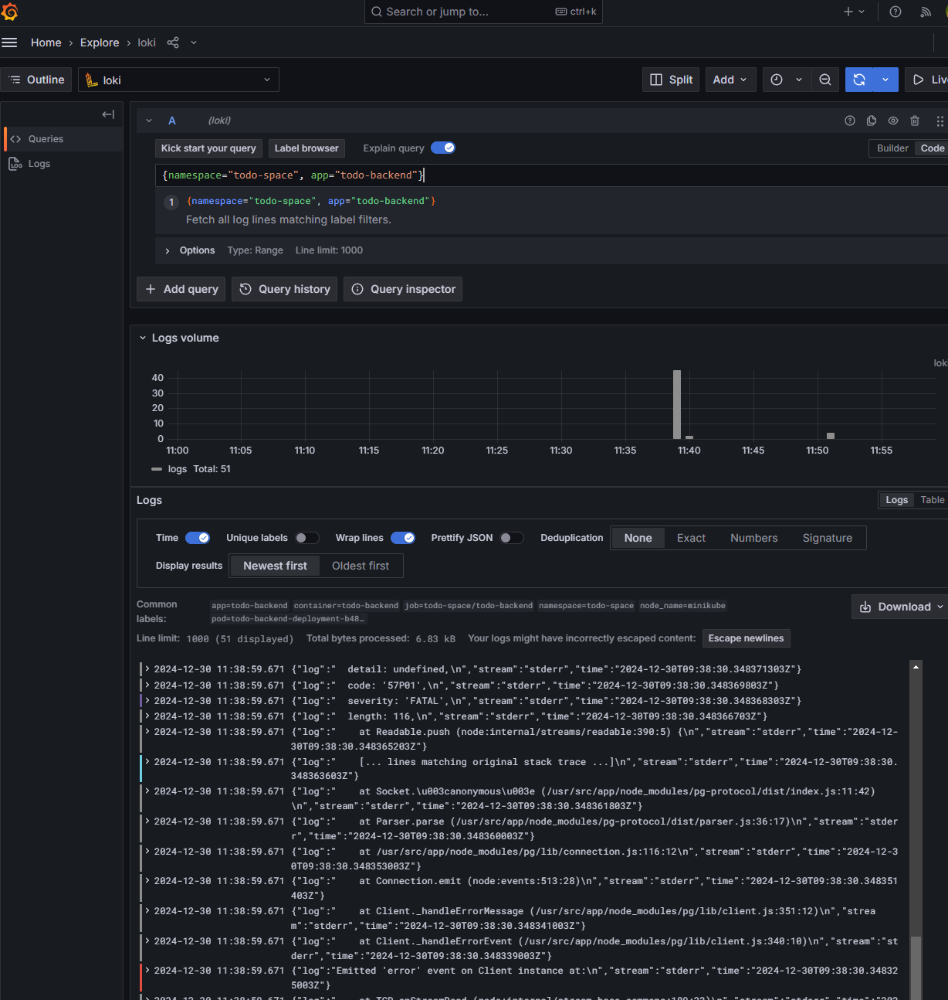

## Exercise 2.10: Project v1.3

1. Request Logging in TODO Backend
- Added middleware to log every incoming HTTP request with
2. 140-Character Limit Validation
- Implemented validation to reject TODO tasks exceeding 140 characters.
3. Set Up Monitoring with Prometheus
```bash
helm repo add prometheus-community https://prometheus-community.github.io/helm-charts
helm install prometheus prometheus-community/kube-prometheus-stack -n prometheus
kubectl port-forward svc/prometheus-kube-prometheus-prometheus -n prometheus 9090:9090
```


4. Configured Loki for Logging
```bash
helm repo add grafana https://grafana.github.io/helm-charts
helm upgrade --install loki --namespace=loki-stack grafana/loki-stack
kubectl exec -it loki-0 -n loki-stack -- wget -qO- http://localhost:3100/ready
```

5. Integrated Grafana with Loki and Prometheus
- Added Loki and Prometheus as data sources in Grafana:
- Loki URL: http://loki.loki-stack:3100
- Prometheus URL: http://prometheus-kube-prometheus-prometheus.prometheus:9090

### Testing and validation
- Request logging check:
```bash
kubectl logs -n todo-space -l app=todo-backend --tail=50
```
- Validation of Character Limit:
```bash
curl -X POST http://<backend-service>:3005/todos -H "Content-Type: application/json" -d '{"task":"A long task exceeding 140 characters..."}'
```
- Metrics in Prometheus:


- Logs in Grafana Explore View: Filter for app=todo-backend

