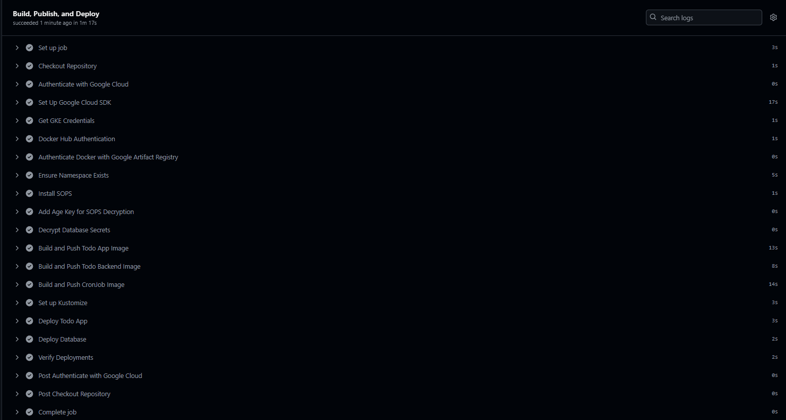
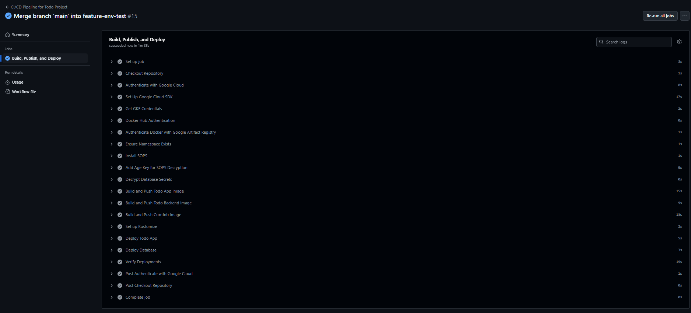
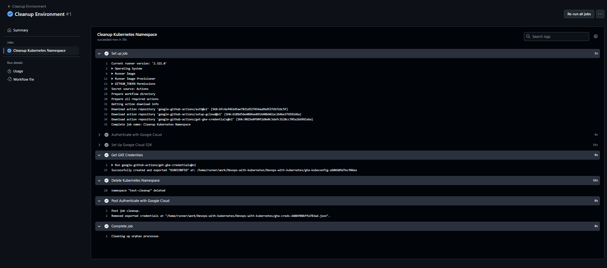

## Exercise 3.03,3.04 and 3,05: Project v1.x

1. Set Up Workflow with GitHub Actions: Automated build, push, and deployment to Kubernetes using Kustomize.
2. Configured Database Pod: Fixed PostgreSQL initialization issues with proper PGDATA and subPath configuration.
3. Persistent Storage: Corrected PersistentVolumeClaims (image-pvc, todo-pvc, postgres-storage) with appropriate StorageClasses.
4. Secrets Management: Ensured database secrets (POSTGRES_USER, POSTGRES_PASSWORD, POSTGRES_DB) were securely managed and loaded.
5. Feature Environment Deployment:
- Each branch now deploys into its own Kubernetes namespace using GitHub Actions.
6. Automatic Cleanup on Branch Deletion:
- When a branch is deleted, the corresponding Kubernetes namespace is also cleaned up.

- Working workflow:

- Branch workflow for Exercise 3.04:

- Branch namespace delete:
