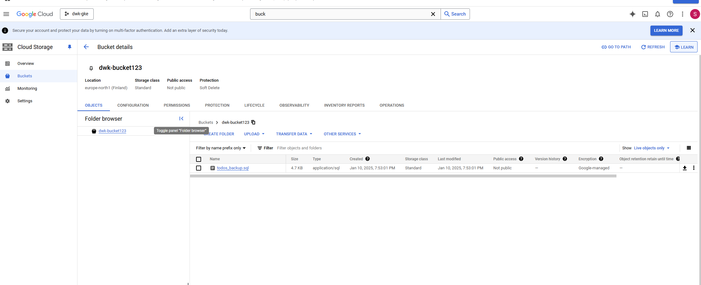

## Exercise 3.07

### Goal:
- Create Kubernetes Cronjob that backs up PostgreSQL database and saves it to Google Cloud Storage
1. Created a Kubernetes Secret to securely store GCS credentials (gcs-backup-key).
2. Cronjob:
- Runs daily at midnight
- Uses pg_dump tp back up database to temporary file
- Uploads this file to GCS bucket using gsutil

- Image from bucket where backups are stored:
