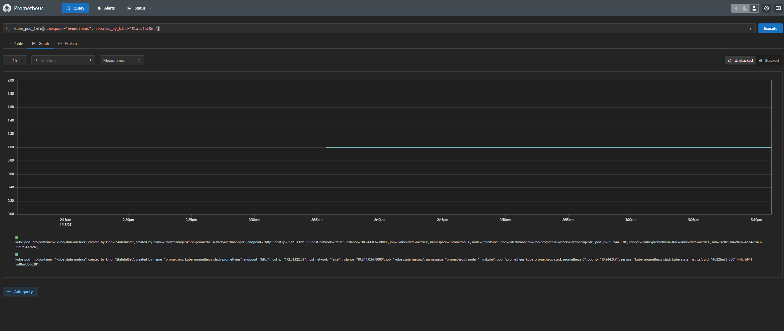

## Exercise 4.03
1. What was done:
- Installed Prometheus: Used Helm to install Prometheus in the prometheus namespace.
- Confirmed Pods: Verified that all Prometheus-related pods, including alertmanager, grafana, and prometheus, are running successfully.
- Accessed GUI: Used kubectl port-forward to access the Prometheus GUI at http://localhost:9090.
- Wrote Query: Queried for kube_pod_info{namespace="prometheus", created_by_kind="StatefulSet"} to identify StatefulSet-created pods in the prometheus namespace.

2. Results
- Pods Identified: The query successfully returned data for pods created by StatefulSets in the prometheus namespace.
- Details Displayed: The results included pod names, containers, and other relevant metadata

Prometheus on localhost:9090 and pod info in prometheus namespace, created by StatefulSet:

