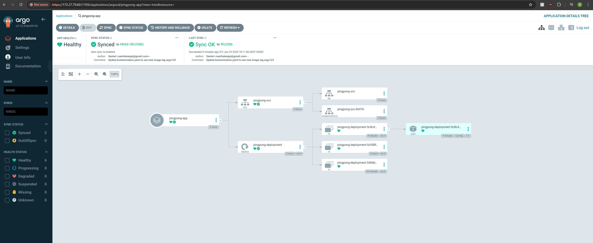

# 📚 Exercise 4.07: Readiness Probe Implementation
- Set up ArgoCD for managing Kubernetes applications.
- Created a Kustomization file to manage the Ping-pong app’s deployment.
- Built and pushed a new Docker image for the Ping-pong application.
- Configured ArgoCD to sync the app automatically from GitHub.
- Set up automatic sync for configuration changes, making deployments seamless.
- Validated that the application updates automatically by changing the Docker image and syncing via ArgoCD.

