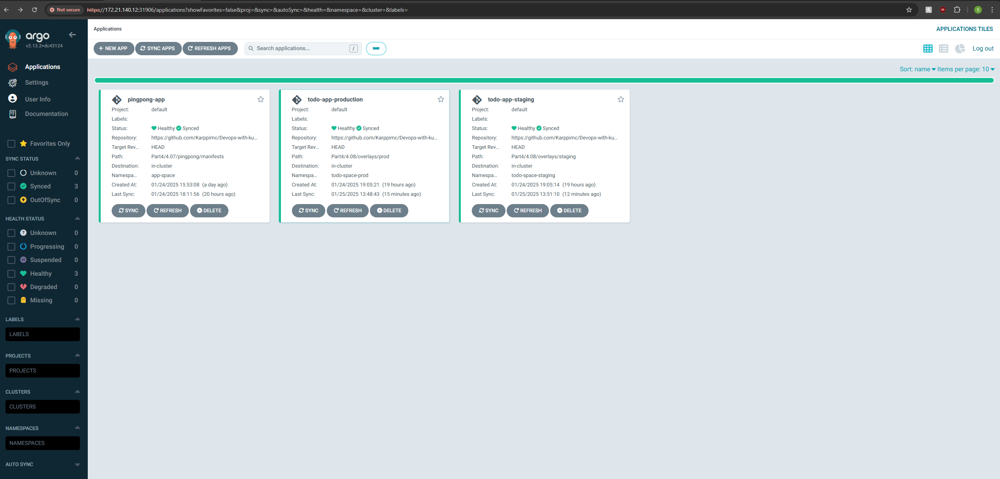

## Exercise 4.08

1. Created two separate environments:
- Production (todo-space-prod)
- Staging (todo-space-staging)

2. Implemented Kustomize for managing environments:
- Defined a common base in base/.
- Created environment-specific overlays for staging and prod under overlays/.

3. Used ArgoCD to manage deployments:
- Configured two applications for production and staging in ArgoCD using application.yaml.
- Pointed ArgoCD to respective environment overlays (overlays/prod and overlays/staging).

4. Set up automated deployments:
- Configured ArgoCD to automatically deploy staging on commits to the main branch.
- Configured ArgoCD to deploy production on tagged commits.

5. Set up environment-specific configurations:
- Staging: Broadcaster logs messages without forwarding them to external services. Database backup disabled.
- Production: Full production setup.

6. Applied the changes to ArgoCD:
- Successfully deployed the staging and production versions of the application via ArgoCD.

