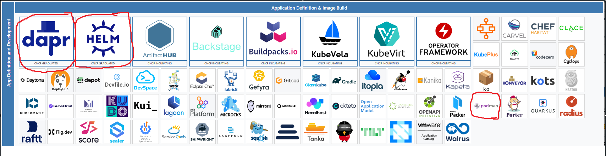
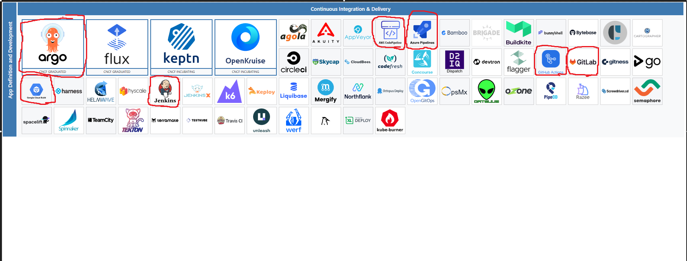
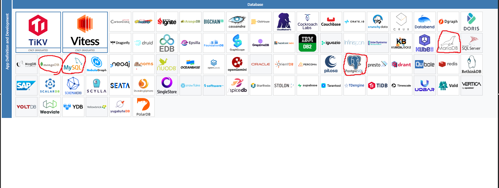
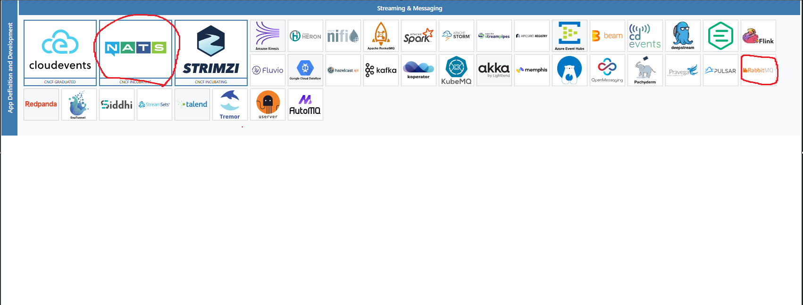
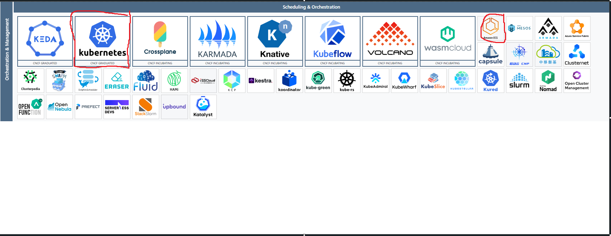
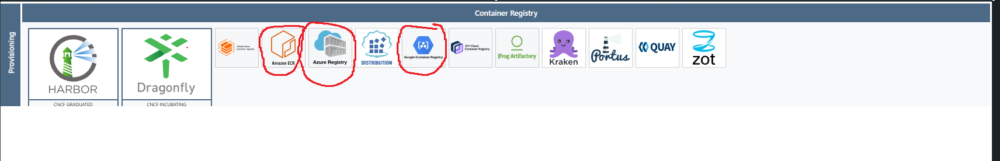
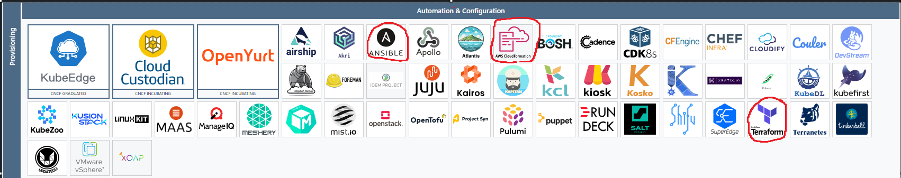
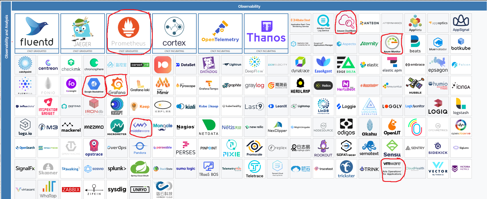

# 5.08

- Dapr                - I used this regarding software architecture course, we checked what kind of stuff can be used to simplify microservice architecture development
- Helm                - used in this project to download many different packages
- Podman              - used this in another course, checked how different container services work

- Argo                - used in this project
- Google Cloud Build  - Used in this project but also I have done Google DevOps engineer course where we went trough these
- AWS CodePipeline    - I have done couple courses regarding AWS cloud and architecture and there we used these tools
- Azure Pipeline      - I did DevOps course where we used Azure Pipelines
- GitLab              - Same course we used GitLab CI/CD
- GitHub Actions      - Used in this course but also I have Websoftware Production course where we used Actions to make CI/CD pipeline with tests etc.
- Jenkins             - Don't have a lot experience with this yet. I have been trying to study it

- MongoDB                - used in Backend/Fullstack course as NoSQL database
- MySQL                  - Db course where this was used
- PostgreSQL             - Used in this project but also I had whole course regarding SQL Databases so we mostly used Postgre and Lite
- MariaDB                - Used mostly in AWS courses

- NATS                - used in this course
- RabbitMQ            - I implemented messaging to different microservice with this inSoftware architecture course.
- Apache ActiveMQ     - Wasnt on the list but I also used this in the same course as previous

- Kubernetes                - used in this course and been using it on my freetime to explore etc
- Amazon ECS                - I used this in different AWS courses

### Service Proxy

- NGINX                     - Used in this course also in few other courses in my school

### Service Mesh

- AWS App Mesh              - Again used in AWS course

### Coordination & Service Discovery

- AWS Cloud Map             - Again AWS courses

### Cloud Native Storage
- Amazon Elastic Block Store (EBS) - Used in AWS courses
- Google Persistent Disk     - Used in Google DevOps course from Coursera

- Amazon Elastic Container Registry (ECR)                - AWS courses
- Azure Registry                                         - DevOps course
- Google Container Registry                              - Another devops course also checked in this course how it works

- Ansible                                                - Tinkered with this on my free time, still quite new to it
- AWS CloudFormation                                     - AWS course
- Terraform                                              - Same as Ansible, also one Google course has stuff about Terraform but I'm just about to start it

- Prometheus                                                - Used in this course
- Amazon Cloudwatch                                         - AWS course
- Azure Monitor                                             - Devops course
- Google Stackdriver                                        - Google devops engineer certificate course, also here?
- Grafana                                                   - This course, also loki for this
- Middleware                                                - Not 100% sure but I think we used this in one course or something similar
- Vmware                                                    - Not 100% sure but I think we used this in one course or something similar

